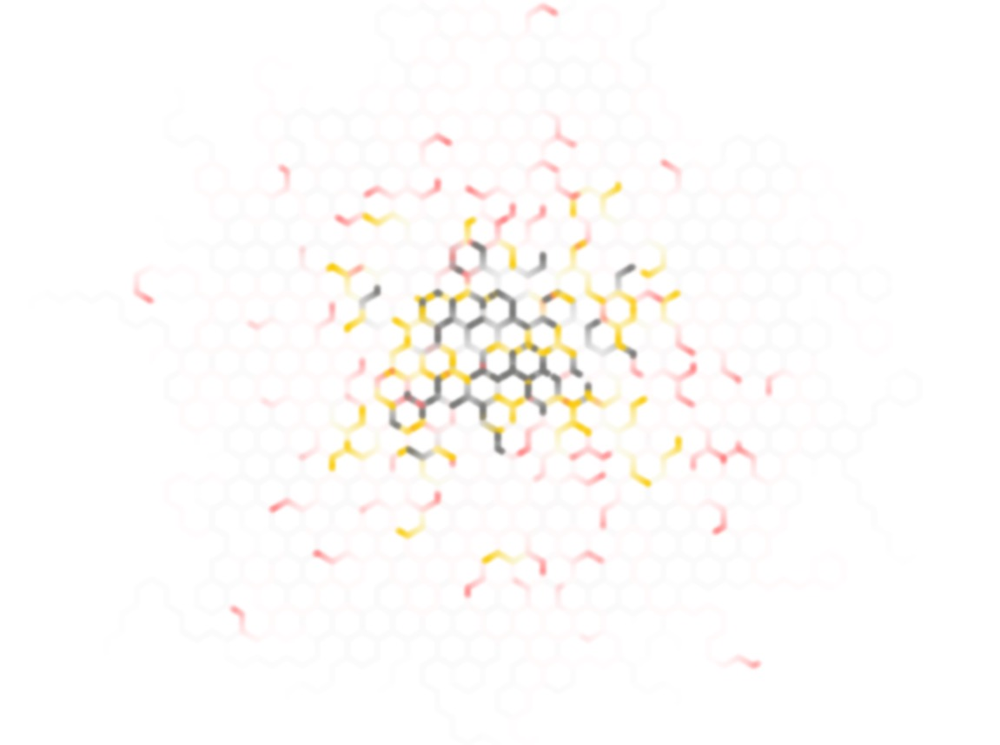
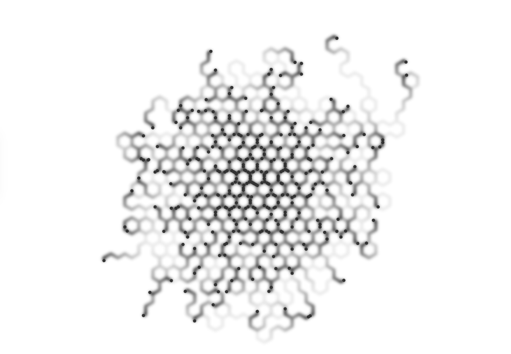
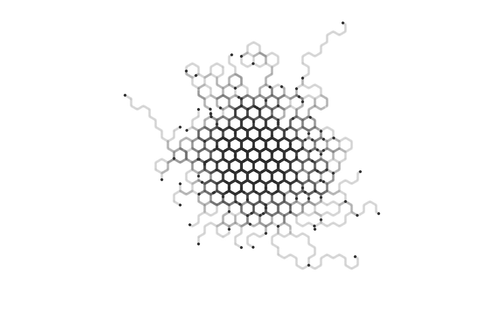
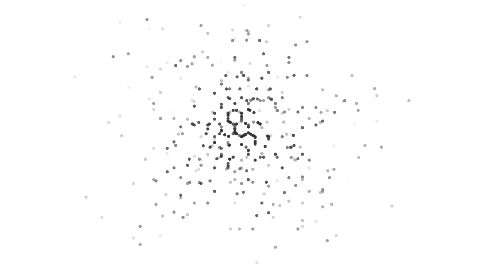

# Canvas - Hex

Install dependencies:
```
yarn install
```

Start webpack-dev-server:
```
$ npm start
```

Start watch:
```
$npm run dev
```

Build project:
```
$ npm build
```

### New colors


### Dots with trail disolve + blur:


### Dots with trail:


### Dots:
